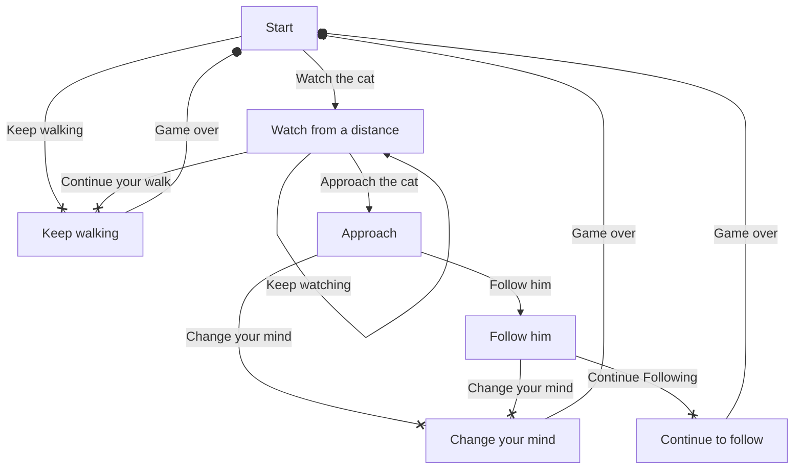

---
# FiniteStateLab
A lite CYOA game/framework created for the "Finite state lab" in CS 439.1

---
## Introduction
This short, feature-light game tells a story of the reader and a assumedly stray cat they happen upon.
The reader can follow the cat or continue on home. Here is a flowchart of game states and transitions.

## Technical Framework
I developed a very basic framework in the Java programming language. 
The game controls user input and starts with a single node.
Each node contains a description. A node can be thought of as the page in a storybook.
Each node also contains a list of choices, which have a text prompt associated with them and link to yet another node.

With this framework, it is possible to create node objects for the pages of a story and add choices to each not that point to another page.

## Installation
I have this running as an IntelliJ project, but any application which can compile and run raw `.java` files should suffice.
1. Clone the repository to a folder on the local device.
2. Open said folder in an application capable of compiling and running multiple `.java` files.
   IntelliJ and VSCode are good options.
3. Compile and run the `Main.java` class.

## Node Storage
Only a single node is stored in the game: the current node.
When a game is constructed, a starting node is passed into the object and becomes the current node.

The gameplay loop containing all nodes can be thought of as a directed graph of sorts (more on that below).
Despite that, the game only needs a reference to a single node.

## Node Transitions
Nodes have a list of choices. 
These choices are records that have a description of the choice action (ex. "Open the door")
and a reference to the node that choice brings the user to.

When the user picks a choice among a Node's list of choices, 
the choice transitions the game state by returning the choice's reference node, which becomes the game's current node.
If a returned node has no choices, it is an end node. 
The game stops playing nodes when and end node is reached.

## Reflection
This format of creating nodes and choices that link them was rather straightforward.

Perhaps I would have liked to add nodes with choices that require certain items,
but after a lot of toying around, I decided against this feature for the sake of time.
With the current structure, to implement an inventory system would require a great deal of refactoring,
which rather saddened me as I tried to make this framework as modular and capable as I could.
Alas, that's par for the course, isn't it?

While the framework has only a few features, this lightweightness does lend itself to great simplicity, 
meaning little programming knowledge is required in order to make a playable game.

## Proudful Particulars
I am particularly proud of that last part in the reflection.
I always aim to make my code as human-readable as possible,
and here I believe that I did particularly well.
My brother--who does know some programming, but who also hasn't touched Java in years--
caught on quite quickly.
My girlfriend figured it out in only several minutes after asking a lot of questions about how weird Java syntax is
(as a non-programmer who asks me to do everything with her computer).

Anyway. It's not much, so there's not much to be proud of, but I'm happy with the way it turned out.

## Future Considerations
As stated earlier, I would have liked to add an inventory system complete with nodes/choices that require certain items.
Unfortunately, with the way nodes, choices, and game objects are structured, it would be hard to establish proper scoping
for gaining items, using items, losing items, and requiring items.

I also would've liked to make a bigger game. 
While this is possible with the way the application is currently structured,
it would include a lot of lines of code that eventually lead to a large, hard-to-track main method.
Perhaps a dedicated editor could be a good plan for the future? 
Perhaps said editor could even export and import JSON files that the user themselves need not understand thanks to the editor?

An interesting prospect.

---
